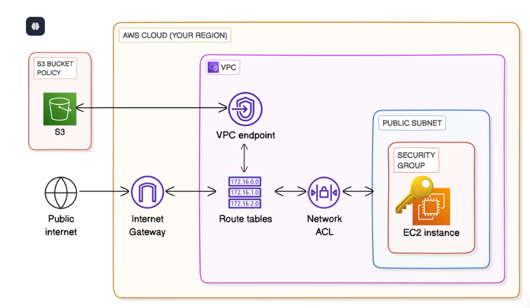
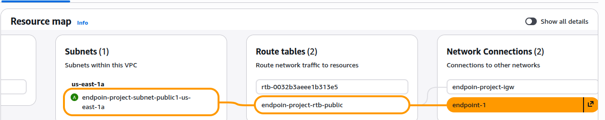

# 🔐 Secure Private Access to Amazon S3 Using VPC Endpoint

## ❓ Problem Statement

In many AWS architectures, private workloads (such as EC2 instances without public exposure) still need access to AWS services like Amazon S3. The default approach routes this traffic through the public internet using an Internet Gateway or NAT Gateway, which introduces:

* Unnecessary internet exposure
* Higher costs (NAT Gateway data processing)
* Weaker security boundaries

This project addresses the problem of **securely accessing S3 from within a VPC without using the public internet**.

---

## 🧠 Solution Overview

The solution uses an **Amazon S3 Gateway VPC Endpoint** to provide private, direct connectivity between a VPC and Amazon S3. Access to the S3 bucket is further restricted using a **bucket policy that only allows requests originating from the specific VPC endpoint**.

As a result:

* S3 traffic never traverses the public internet
* NAT Gateway is not required
* All non-endpoint-based access is explicitly denied

---

## 🏗️ Architecture Overview

### Architecture Diagram



The diagram illustrates how an EC2 instance inside a VPC accesses Amazon S3 **privately** using a Gateway VPC Endpoint, without traversing the public internet.

### Core Components

* Custom Amazon VPC
* Public Subnet (single Availability Zone)
* EC2 instance running Amazon Linux
* Amazon S3 bucket
* S3 Gateway VPC Endpoint
* Route table–based S3 routing
* Restrictive S3 bucket policy

### Traffic Flow

```
EC2 Instance
   ↓
VPC Route Table (S3 Prefix List)
   ↓
S3 Gateway VPC Endpoint
   ↓
Amazon S3
```

### Explicitly Excluded Components

* NAT Gateway
* Internet Gateway for S3 traffic
* Public S3 access

---

## 🛡️ Security Model

This project enforces security at **both the network and service levels**.

### Network-Level Security

* The Gateway VPC Endpoint ensures all S3 traffic remains on the AWS private backbone
* Route tables redirect S3-bound traffic automatically to the endpoint

### Service-Level Security (Bucket Policy)

An explicit `Deny` policy is applied to the S3 bucket using the `aws:sourceVpce` condition key.

Key characteristics:

* All requests are denied by default
* Only requests originating from the specified VPC endpoint are allowed
* AWS Console and internet-based access are blocked

This approach follows a **zero-trust model**, where access is granted only when both identity and network conditions are satisfied.

---


## ✅ Validation and Guarantees

The following behaviors are guaranteed by this design:

* EC2 instances can access the S3 bucket successfully via the VPC endpoint
* S3 access does not require internet connectivity or NAT
* AWS Management Console access to the bucket is denied
* Requests from outside the VPC endpoint fail with `AccessDenied`

These outcomes confirm that the bucket is fully isolated from public access paths.

---

## ⚖️ Design Trade-offs and Limitations

* Gateway VPC Endpoints are supported only for Amazon S3 and DynamoDB
* Access is limited to the same AWS Region
* Endpoint-based access is tied to a specific VPC
* Not suitable for non-AWS or third-party services

This design prioritizes **security and cost efficiency** over flexibility.

---

## When to Use This Architecture

**Recommended when:**

* Running private workloads that require S3 access
* Minimizing internet exposure is a priority
* Reducing NAT Gateway costs
* Enforcing strong network-level access controls

**Not recommended when:**

* Applications require cross-cloud or external service access
* Public access to S3 is acceptable
* Multi-region S3 access is required

---

## Key Takeaways

* VPC Gateway Endpoints enable private AWS service access without the internet
* Route tables control service-level traffic flow
* S3 bucket policies can enforce network-based restrictions
* Combining IAM and network conditions provides strong defense-in-depth

---

## Summary

This project demonstrates a production-grade AWS pattern for **secure, private, and cost-effective access to Amazon S3**. It reflects real-world cloud security practices commonly used in enterprise environments to eliminate unnecessary internet exposure while maintaining full functionality.
Author: Emaan Chaudhary
